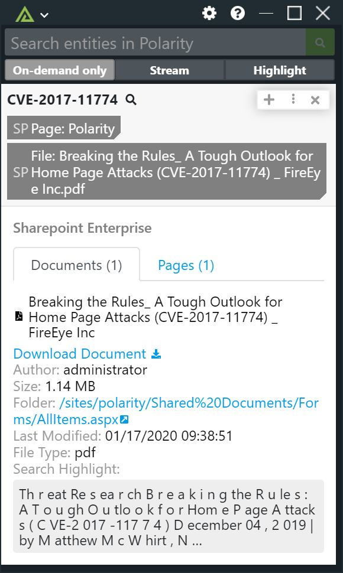

# Polarity Sharepoint Enterprise Integration

The Polarity Sharepoint Enterprise integration allows freeform text searching for IPs, Hashes, domains, and emails  in your Sharepoint instance and retrieves related documents.

For more information on Sharepoint, please visit: [official website] (https://products.office.com/en-us/sharepoint/collaboration).

Check out the integration in action:

## Configuring Sharepoint

The Sharepoint Enterprise integration connects to Sharepoint 2013 and Sharepoint 2016 on-premise servers using user credential authentication over NTLM.  

## Sharepoint Integration Options

### Sharepoint Site Url

The sharepoint Site URL to use for querying data. The URL should include the scheme (https://) and port is necessary. As an example, for a site called "mycompany", this option might be set to "https://internal.sharepoint.corp/sites/mycompany".

### Username

The username of the account you wish to use to connect to your Sharepoint Onprem Enterprise instance.

### Password

The password for the given domain username.

### Domain

The domain for the given username and password.

### Exact Match Search

If checked, the search will look for exact matches. This option is enabled by default.

## Polarity

Polarity is a memory-augmentation platform that improves and accelerates analyst decision making.  For more information about the Polarity platform please see:

https://polarity.io/
